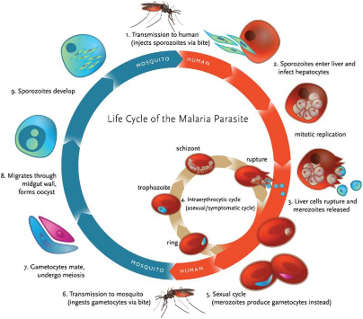
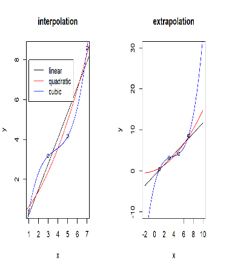
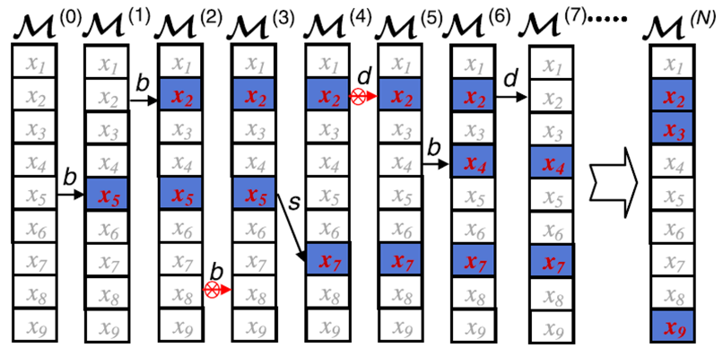

```{r setup, include=FALSE}
options(htmltools.dir.version = FALSE)
```


# Brief background on Malaria 

.pull-left[
- In 2016, approximately 216 million cases and 445,000 malaria deaths

- Nearly half the world's population is at risk

- Millennium Development Goals outlined specific targets for control/elimination

  * Significant funding investments (US and Worldwide)
  
  * Led to dramatic decreases in disease burden
  ]
  
.pull-right[



]


???

- Over 90% of cases occur in SSA 
- Nearly 95% of moralities occur in children < 5 years in SAA
- $2.7 billion US in 2016
- ITNs, IRS, ACT

---
background-image: url('img/map-combined.png')
background-size: contain
class: blank

???

- Progress made since 2000, estimated 2 million lives saved
- Nearly 50% reduction worldwide
- Despite this progress, many regions continue to experience high transmission rates and disease burden
- Example district in northern Ghana

---

class: blank, middle, center
```{r out.width='100%', out.height='100%', fig.height=6, echo=FALSE, message=FALSE, warning=FALSE}
library(leaflet)
library(rgdal)
library(sp)

byd_shp <- readOGR("shp/Study_Area_NEW.shp", verbose = FALSE)

leaflet() %>%
  addPolygons(data = byd_shp,
                  color = "black",
                  weight = 2,
                  opacity = 1,
                  fillOpacity = 0.2) %>%
  addTiles() %>% addScaleBar(position = 'topleft') %>% setView(-1, 8, zoom = 6)

```

???
- Location of Bunkpurungu-Yunyoo
- Relatively small area, ~ 30-40 across in both directions

---

background-image: url('img/landscapes.png')
background-size: contain
class: blank

???

- Examples of the various ecological landscapes that exist in BYD
- Occur in relatively small area
- Modest Urban Centers

---
background-image: url('img/byd-heatmap.png')
background-size: contain
class: blank

???
- Describe data: ~12,000 children over six biannual surveys
- High degree of spatial heterogeneity 
- Rainy season: 20-30% urban areas, 70-80% rural areas (10 km)
- Near universal bed net coverage, IRS
- Drives need for targeted interventions
- Need for comprehensive evaluation of risk factors on a local level

---
background-image: url('img/risk-slide-1.png')
background-size: contain
class: blank

???

- Malaria is a vector-borne disease, creating three critical stages for risk factors

---
background-image: url('img/risk-slide-2.png')
background-size: contain
class: blank

???

- There are MANY factors associated with each of levels
- Common in many other fields

---
background-image: url('img/risk-slide-3.png')
background-size: contain
class: blank

???

- And these patterns can be complex
  * Interactions
  * Nonlinear effects

- In many cases data is sparse

---
background-image: url('img/needle.png')
background-size: contain
class: full

???

- This is referred as the Small N, Large P


---

# Too much information can be a problem

.pull-left[
- Possible Models = $2^P - 1$

- If $P$ is large, this can be a huge number

- Increased risk of over-fitting

- Several important qualities to consider:
  * Interpret ability
  * Predictive Ability
  * Complexity
  * Uncertainty
]

.pull-right[



]

???
- Too much predictive or explanatory info can create big problems
- explain over-fitting
- outline why each of these properties are important
- need for variable selection: step wise regression, ridge, lasso

---
class: middle, center

## Bayesian Model Averaging




???
- An alternative approach to variable selection
- actually model selection
- works by randomly adjusting the model, fitting the parameters, and averaging
---
background-image: url('img/bma-1.png')
background-size: contain

---
background-image: url('img/bma-2.png')
background-size: contain

---
background-image: url('img/bma-3.png')
background-size: contain

---
background-image: url('img/bma-4.png')
background-size: contain

---
background-image: url('img/bma-5.png')
background-size: contain

---
background-image: url('img/bma-6.png')
background-size: contain

---
background-image: url('img/bma-7.png')
background-size: contain

???
- Repeat over and over (10,000 iterations)
- Each time the regression coefficients are estimated
- Important covariates tend to be included
- Average all models together

---
background-image: url('img/risk-factor-1.png')
background-size: contain

# Outputs

???
- 29 covariates (imaging trying to create individual models)
- Credible intervals
- observations: classic patterns, distance measures
- are there more complex patterns? Seasonal dependencies? nonlinear relationship?

---
background-image: url('img/risk-factor-2.png')
background-size: contain

# Seasonal Interactions

---

background-image: url('img/risk-factor-3.png')
background-size: contain

# Linear splines

---
class: inverse, center, middle

# Overfitting?

???
- after adding all of these additional covariates, is our model still any good?
- out-of-sample prediction
- season to season prediction
- Logistic Regression and Lasso

---
# Accessing Prediction Performance

```{r predict, echo=FALSE, fig.width=10, fig.align='center'}
library(ggplot2)

model <- c(rep("Base Model (p = 29)", 3), rep("Enhanced Model (p = 73)", 3))
method <- rep(c("Logistic", "Lasso", "BMA"), 2)
likeli <- c(-1022.49, -988.92, -976.47, -1061.66, -1026.95, -975.06)

dt <- data.frame(Model = model, Method = method, Likelihood = likeli)


ggplot(dt, aes(x = Model, y = Likelihood, fill = Method, label = Likelihood)) +
  geom_col(position = "dodge") + 
  scale_y_reverse(limits = c(-960, -1075), oob = scales::squish) +
  geom_text(position = position_dodge(width =  0.9), size = 4) +
  ylab("log Likeihood") +
  theme_classic()

```
???
- Explain the graph (values)
- Both Lasso and BMA are also way better than Logistic
- Some instances were Lasso slightly outperformed BMA for base model
- BMA always out-performed Lasso for the extended model 

---

# Conclusions

## Risk Factor Analysis
- Classic pattern of malaria risk factors (e.g. age, wealth) observed in the Bunkpurugu-Yunyoo data set
- Modest urban centers have a significant effect on early childhood malaria prevalence
- Age-related risk was more significant during the dry season
- Distance to nearest urban center and health facilities were significant nonlinear risk patterns

## Application of BMA
- Flexibility: Models can be adjusted to account for complex patterns
- Interpret ability: Individuals parameters can be directly related to dependent/outcome variable
- Uncertainty: Credible intervals are easily constructed
- Prediction: Outperformed logistic regression and was resistant to over-parameterization

---
class: inverse, center, middle

# Questions?

